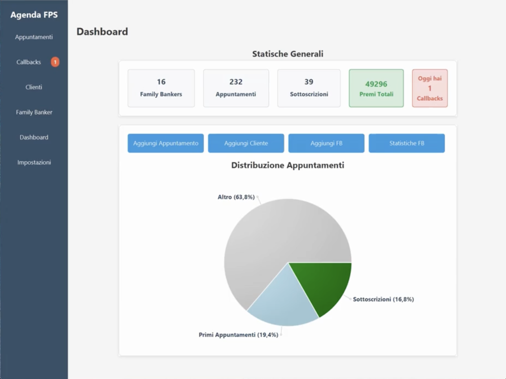
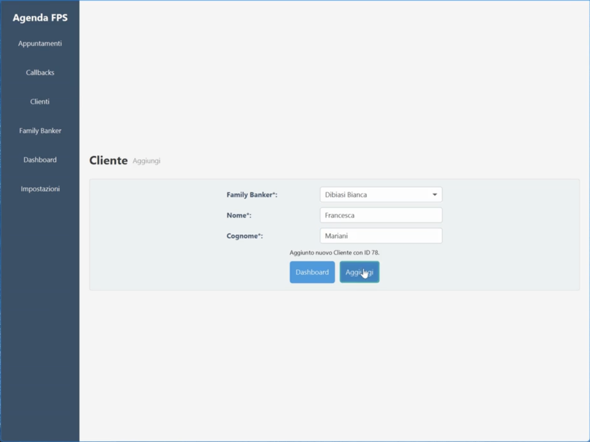
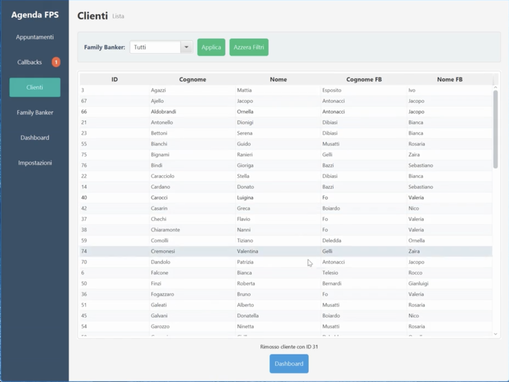
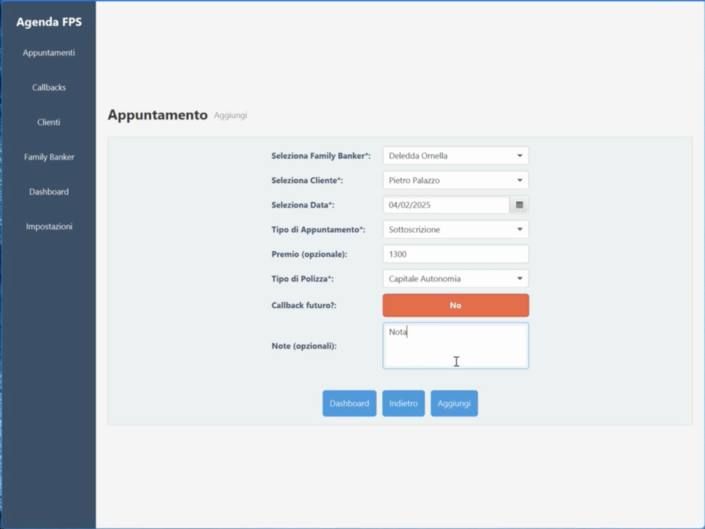
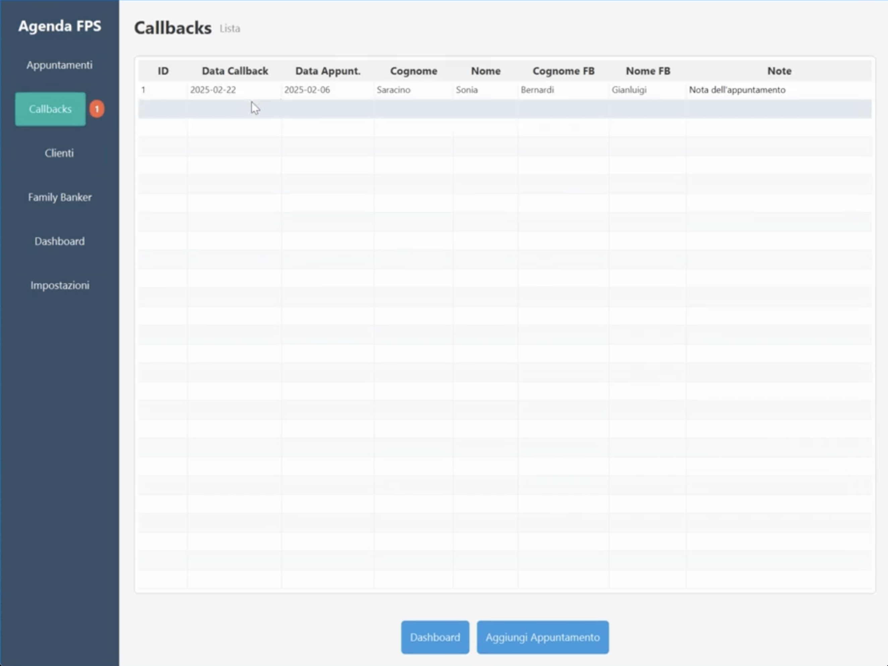
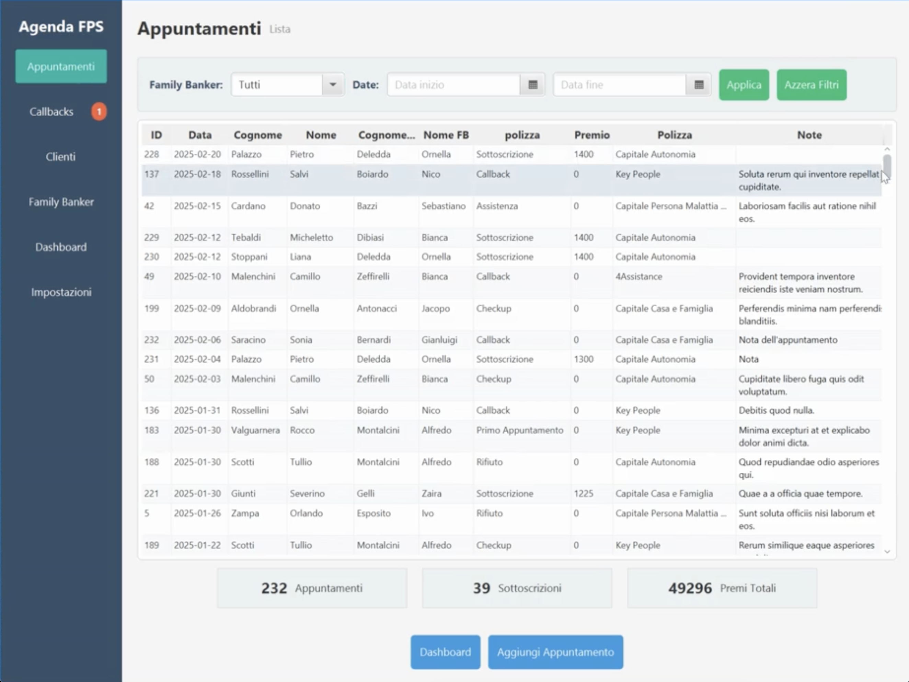
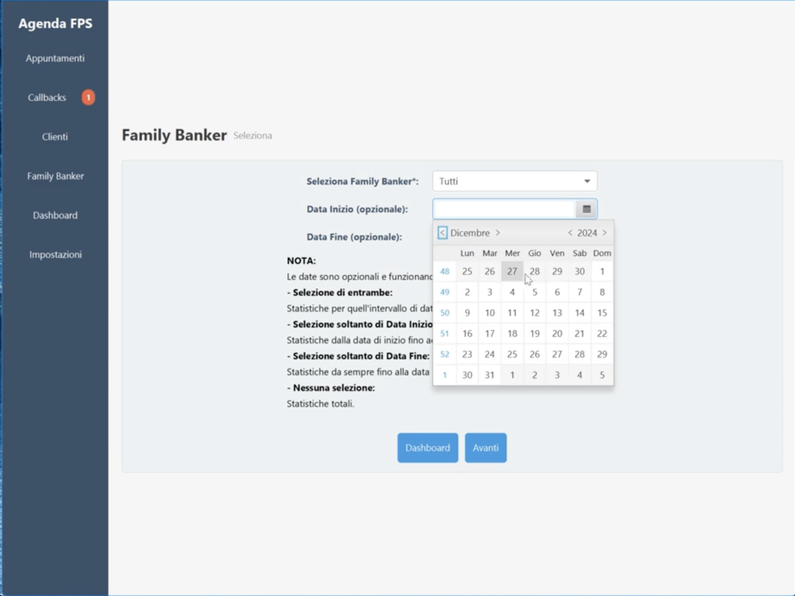
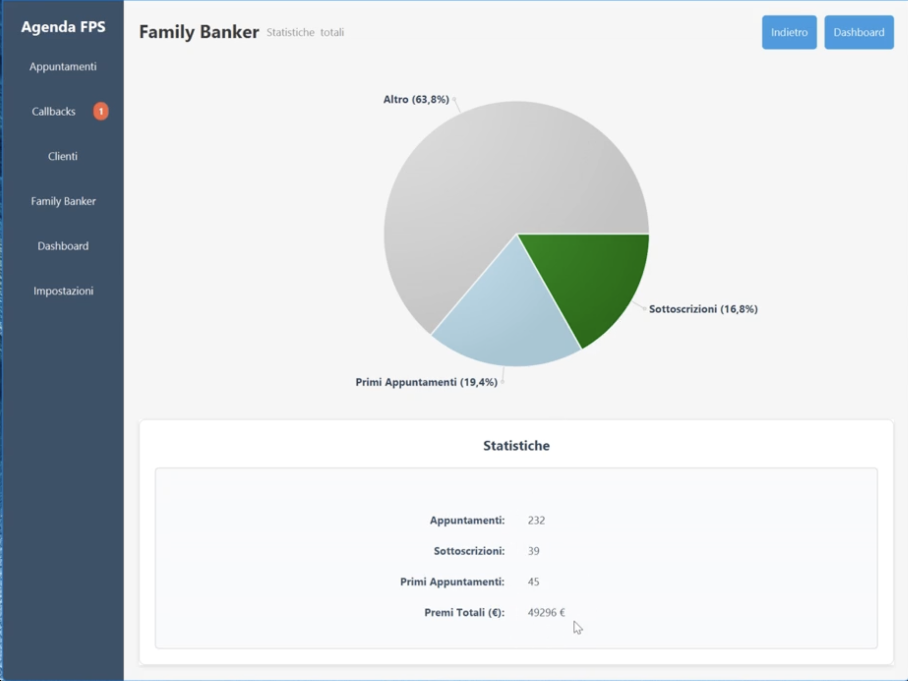
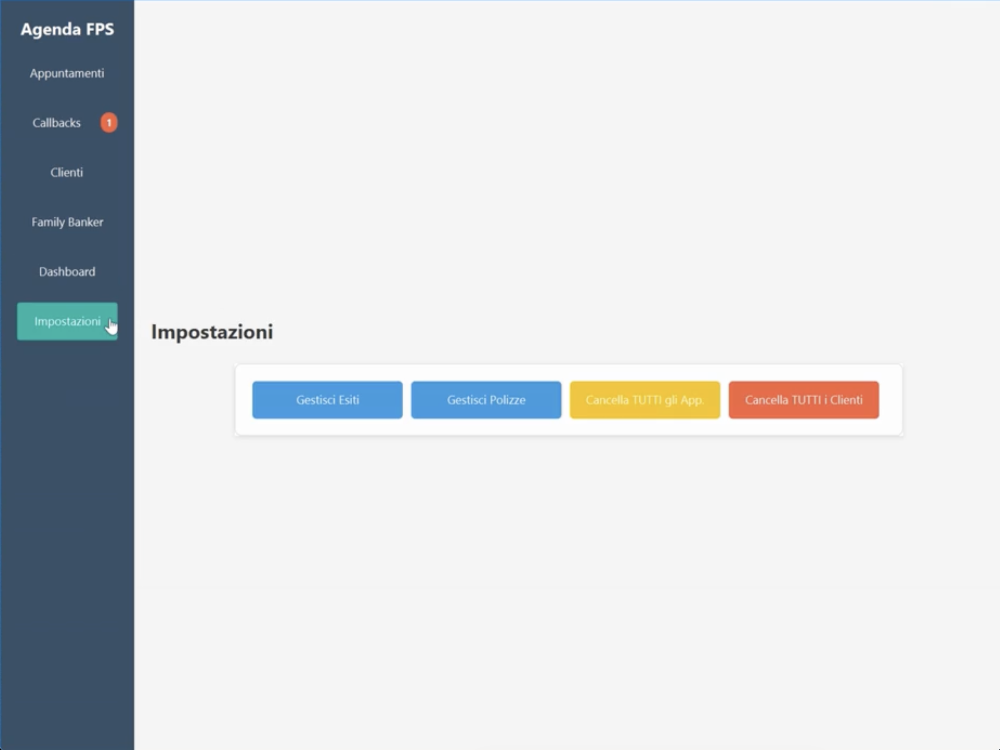

# Agenda FPS

**Agenda FPS** è un’applicazione desktop sviluppata in **Java** per la gestione operativa dell’attività dei *Family Banker* (consulenti), con funzioni dedicate a **appuntamenti**, **clienti**, **callback** (richiami) e **statistiche**. L’obiettivo è offrire una vista centralizzata e strumenti rapidi per inserire, consultare, filtrare e aggiornare i dati, supportando il monitoraggio delle performance tramite dashboard, grafici e tabelle.

## Documentazione
Javadoc: https://nardone-giampietro.github.io/agenda_consulente_assicurativo_fps/

---

## Dashboard (Board)

La schermata principale fornisce:
- **Panoramica generale** dell’attività con statistiche su:
  - numero di *Family Banker*
  - numero di appuntamenti
  - **premi totali** accumulati
- **Evidenza dei callback** previsti per la giornata corrente (con indicatore numerato nel menu)
- **Azioni rapide** tramite pulsanti dedicati:
  - **Aggiungi Appuntamento**
  - **Aggiungi Cliente**
  - **Aggiungi Family Banker (FB)**
  - **Statistiche FB**
- **Grafico a torta** con la distribuzione degli appuntamenti per categoria (es. sottoscrizioni, primi appuntamenti, altre tipologie)
- **Menu di navigazione** laterale per accedere alle sezioni dell’applicazione (Dashboard, Appuntamenti, Callback, Clienti, Family Banker, Impostazioni)

---

## Gestione anagrafiche

### Family Banker
- Inserimento di un nuovo Family Banker tramite form dedicato
- Conferma dell’operazione con messaggio di avviso

### Clienti
- Inserimento di un nuovo cliente con **associazione obbligatoria** a un Family Banker
- I clienti vanno aggiunti **solo se nuovi**: non è necessario reinserirli per creare nuovi appuntamenti

#### Lista clienti
- Visualizzazione tabellare dei clienti
- Filtro per Family Banker
- Operazioni di modifica/rimozione tramite menu contestuale (tasto destro), dove previsto

---

## Gestione appuntamenti

### Creazione appuntamento
Durante l’inserimento è possibile:
- selezionare il **Family Banker**
- selezionare il **cliente** (dalla lista dei clienti associati a quel Family Banker)
- impostare la **data** dell’appuntamento
- definire l’**esito/tipologia** (es. sottoscrizione, callback, ecc.)
- specificare **polizza** e **premio** (quando pertinenti)
- aggiungere una **nota**
- indicare se è previsto un **callback futuro**

### Callback (richiamo)
Un appuntamento può terminare con un callback, ovvero una nuova data pianificata per rivedere il cliente:
- gestione tramite sezione dedicata
- segnalazione sulla dashboard con **indicatore** nel menu (numero di callback pendenti)
- modifica e rimozione dei callback tramite interazione sulla riga (dove previsto)

---

## Liste, filtri e operazioni CRUD

### Tabella appuntamenti
Caratteristiche principali:
- ordinamento automatico (dal più recente al più vecchio)
- filtri per:
  - **Family Banker**
  - **intervallo di date**
- operazioni di **modifica/rimozione** tramite menu contestuale (tasto destro), dove previsto
- riepilogo con statistiche sugli appuntamenti mostrati (aggiornate quando cambiano i filtri)

---

## Statistiche e reportistica

### Selezione statistiche Family Banker
È possibile analizzare:
- statistiche di **tutti i Family Banker** oppure di **uno specifico**
- statistiche su **periodo totale** o su **intervallo di date** con logica:
  - nessuna data impostata → totale complessivo
  - solo data inizio → da inizio a oggi
  - solo data fine → fino alla data fine
  - inizio + fine → nel range selezionato

### Output statistico
- **grafico** riepilogativo (analogo alla dashboard)
- **tabella** con i dati completi, inclusi i **premi totali** nel periodo selezionato

---

## Regole di integrità e cancellazioni a cascata

Alcune eliminazioni comportano rimozioni automatiche di dati correlati:
- eliminare un **Cliente** ⇒ elimina **tutti gli appuntamenti** associati al cliente
- eliminare un **Family Banker** ⇒ elimina **tutti i clienti** associati **e** tutti gli appuntamenti dei relativi clienti
- eliminare un **Appuntamento** ⇒ non ha effetti su altri dati

Queste regole rendono necessario operare con attenzione prima di eseguire cancellazioni su Clienti o Family Banker.

---

## Impostazioni e personalizzazione

Nel pannello **Impostazioni** è possibile:
- gestire gli **esiti** degli appuntamenti:
  - aggiunta nuovi esiti
  - modifica/rimozione esiti esistenti
- gestire l’elenco delle **polizze**:
  - aggiornamento nomi
  - aggiunta di nuove polizze

Funzioni di reset (utili, ad esempio, a inizio anno lavorativo):
- **elimina tutti gli appuntamenti**
- **cancella tutti i clienti** (con conseguente eliminazione automatica degli appuntamenti collegati)
- non è prevista la rimozione simultanea di tutti i Family Banker

---

## Navigazione
Dal menu laterale è possibile accedere rapidamente a:
- **Dashboard** (schermata principale)
- **Appuntamenti**
- **Callback**
- **Clienti**
- **Family Banker**
- **Impostazioni**
